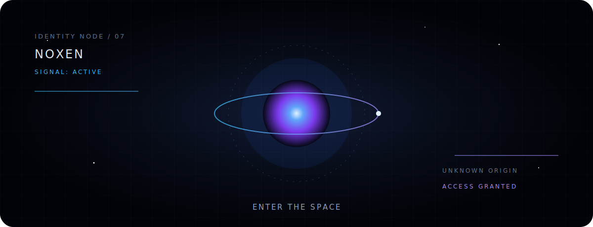

<p align="center">
  <a href="https://sple35981-tech.github.io/sple35981-tech/">
    
  </a>
</p>

<p align="center">
  <code>SYSTEM ONLINE</code>&nbsp;&nbsp;·&nbsp;&nbsp;<code>NODE: NOXEN</code>&nbsp;&nbsp;·&nbsp;&nbsp;<code>ORIGIN: UNKNOWN</code>
</p>

<p align="center">
  <a href="https://sple35981-tech.github.io/sple35981-tech/"><strong>ENTER THE SPACE</strong></a>
  &nbsp;&nbsp;·&nbsp;&nbsp;
  <a href="https://github.com/sple35981-tech?tab=repositories">TRACE THE SIGNAL</a>
</p>

<br>

```text
> wake noxen

[ OK ] identity core
[ OK ] signal relay
[ OK ] anomaly scanner
[ .. ] locating origin

result: no fixed coordinates
```

<table>
<tr>
<td width="33%" align="center">
<sub>01 / REVERSE</sub><br><br>
<strong>BREAK THE SURFACE</strong><br>
<code>binary → behavior</code>
</td>
<td width="33%" align="center">
<sub>02 / SECURITY</sub><br><br>
<strong>FOLLOW THE TRACE</strong><br>
<code>signal → evidence</code>
</td>
<td width="33%" align="center">
<sub>03 / AUTOMATION</sub><br><br>
<strong>REPEAT THE IMPOSSIBLE</strong><br>
<code>chaos → system</code>
</td>
</tr>
</table>

<br>

<p align="center">
  <samp>
    NO BIOGRAPHY&nbsp;&nbsp;·&nbsp;&nbsp;NO SKILL BARS&nbsp;&nbsp;·&nbsp;&nbsp;ONLY SIGNALS
  </samp>
</p>

<br>

<details>
<summary><strong>OPEN TRANSMISSION</strong></summary>
<br>

```text
01001110 01001111 01011000 01000101 01001110

The interface is not the identity.
The repository is not the destination.
The signal continues elsewhere.
```

<p align="center">
  <a href="https://github.com/sple35981-tech/claude-cc-switch-bat">NODE_01</a>
  &nbsp;·&nbsp;
  <a href="https://sple35981-tech.github.io/sple35981-tech/">NODE_∞</a>
</p>
</details>

<br>

<p align="center">
  
</p>

<p align="center">
  <sub>AUTHORIZED ACCESS ONLY · LEAVE THE SYSTEM BETTER THAN YOU FOUND IT</sub>
</p>