<p align="center">
  <a href="https://sple35981-tech.github.io/sple35981-tech/">
    
  </a>
</p>

<p align="center">
  
</p>

<br>

<table>
<tr>
<td width="13%"><code>0x01</code></td>
<td width="30%"><strong><a href="https://github.com/sple35981-tech/claude-cc-switch-bat">claude-cc-switch-bat</a></strong></td>
<td>One command to assemble a usable AI coding environment across Windows, Linux and macOS.</td>
</tr>
<tr>
<td><code>0x02</code></td>
<td><strong><a href="https://github.com/sple35981-tech?tab=repositories">working set</a></strong></td>
<td>Scripts, unfinished tools, reverse-engineering notes and things worth keeping.</td>
</tr>
<tr>
<td><code>0x03</code></td>
<td><strong><a href="https://sple35981-tech.github.io/sple35981-tech/">desk view</a></strong></td>
<td>A quieter index of the same work, with keyboard navigation and fewer GitHub borders.</td>
</tr>
</table>

<br>

```text
keep the useful part
write down what failed
delete the decoration
```

<p align="right">
  <sub>Noxen / 2026</sub>
</p>
