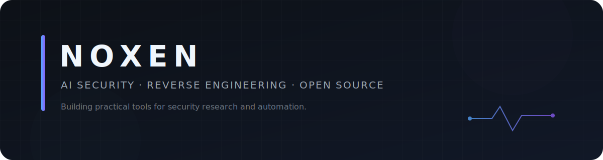

<p align="center">
  
</p>

<p align="center">
  <strong>Turning repetitive security work into tools that can be inspected, rerun and improved.</strong>
</p>

<p align="center">
  <a href="./assets/space-preview.svg">🌌 Space Preview</a>
  ·
  <a href="https://sple35981-tech.github.io/sple35981-tech/">🚀 Enter 3D Space</a>
  ·
  <a href="https://github.com/sple35981-tech/claude-cc-switch-bat">Featured repository</a>
  ·
  <a href="mailto:sple35981@gmail.com">Email</a>
</p>

## About

I work across reverse engineering, security automation and local AI workflows. My focus is practical: build repeatable tooling, keep the process traceable, and document enough that the result can be tested instead of merely demonstrated.

中文：主要折腾软件逆向、安全自动化、CTF、本地 AI 工作流和跨平台开发工具。

## Current focus

- AI-assisted reverse-engineering workflows with traceable outputs
- Cross-platform developer and security environment automation
- Offline knowledge systems for CTF practice and lab research
- Small tools that reduce setup friction on Windows, Kali Linux and Ubuntu

## 🌌 Noxen Space

An interactive 3D showcase built with Three.js.

Drag the planet, explore the space, and discover my projects.

## Featured project

<table>
<tr>
<td width="72%" valign="top">
<h3><a href="https://github.com/sple35981-tech/claude-cc-switch-bat">claude-cc-switch-bat</a></h3>
<p>A cross-platform installer and environment bootstrapper for Claude Code, Codex CLI, Hermes Agent and CC Switch.</p>
</td>
<td width="28%" valign="top">
<strong>Focus</strong><br><br>
Automation<br>
Cross-platform<br>
Developer tools
</td>
</tr>
</table>

## Toolbox

`Python` · `Bash` · `PowerShell` · `Git` · `Docker`

`Windows` · `Kali Linux` · `Ubuntu`

`Reverse Engineering` · `CTF` · `Security Automation` · `Local LLM Workflows`

## Principles

```text
Build for repeatability.
Keep evidence traceable.
Prefer working tools over impressive demos.
```

<p align="center">
  <sub>Security research should stay authorized, reproducible and useful.</sub>
</p>
